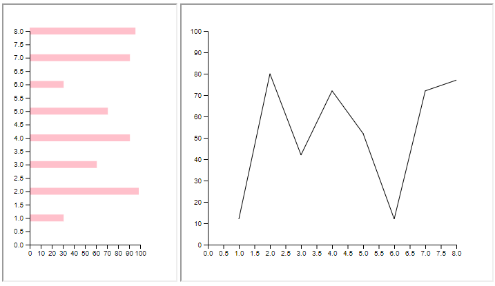
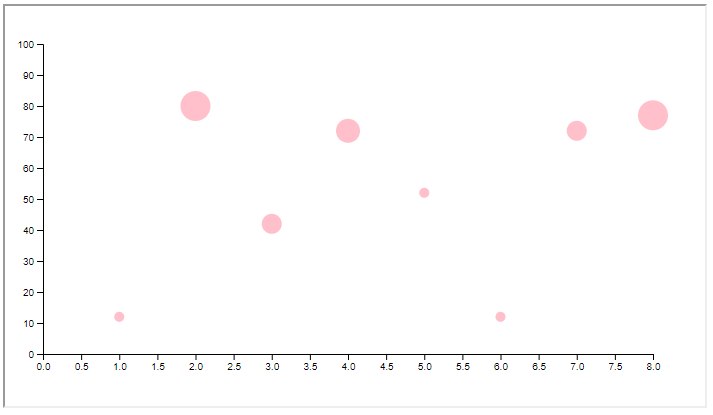

# SemanticVis
This is a new project in which I explore semantic, responsive and accessible data visualizations using web components.
I believe that we need a HTML5 of SVGs.

## One Data Source, Three Representations
Below you can see the same visualization, with the same visualization **content**,
rendered in three different ways.




## Visualization Content
The main idea of this project is to separate visualization content from the representation,
similar to how on the web we try to use semantic and meaningful HTML, and then define the
layout with CSS. Data visualizations do not yet have a meaningful representation of content,
as the SVG specification defines both the content, as well as the specific layout. This leads
to less flexibility in terms of responsiveness and accessibility, as absolute position values
are not meaningful for screen reader context nor flexible for different screen sizes.

Instead, I am trying to define a DOM-based specification of visualization content that can be
rendered in different ways, and read aloud by screen readers, with varied degrees of 
granularity. The three visualizations above are all generated from the example DOM below:
```
<responsive-vis vis-width="500" vis-height="300">
    <vis-scale min-x1="0" max-x1="8" min-x2="0" max-x2="100">
        <data-group>
            <data-point size="5"  x1="1" x2="12"></data-point>
            <data-point size="15" x1="2" x2="80"></data-point>
            <data-point size="10" x1="3" x2="42"></data-point>
            <data-point size="12" x1="4" x2="72"></data-point>
            <data-point size="5"  x1="5" x2="52"></data-point>
            <data-point size="5"  x1="6" x2="12"></data-point>
            <data-point size="10" x1="7" x2="72"></data-point>
            <data-point size="15" x1="8" x2="77"></data-point>
        </data-group>
        <axis-left></axis-left>
        <axis-bottom></axis-bottom>
    </vis-scale>
</responsive-vis>
```

This responsive visualization, built with web components, changes the visual representation of the data depending on
the size of the window. All three are the same website rendering the same data. The last one displays each data
point as a cirlce. The middle representation skips the rendering of individual data points, but instead uses the
data-group to represent all nested data with a single line element. The first visualization is for mobile, as it
flips the axes and displays the data as bars.

Please try out the [Demo](https://michaschwab.github.io/semantic-vis/demo)!